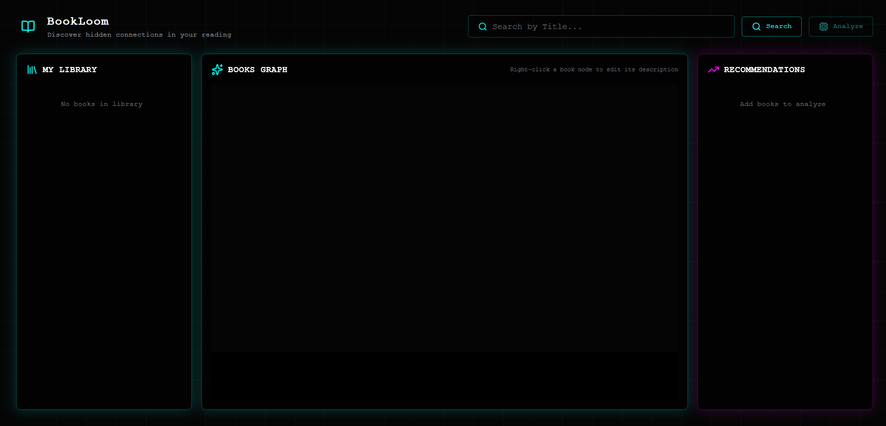
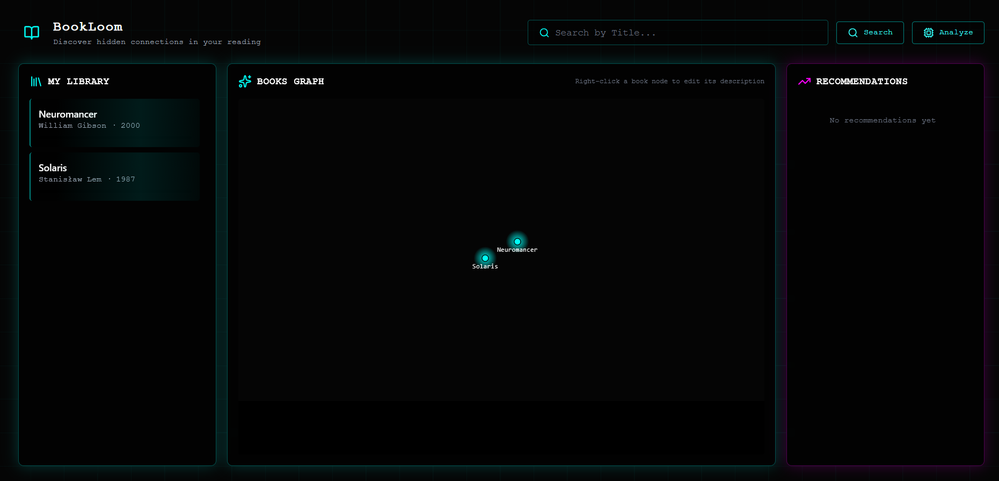
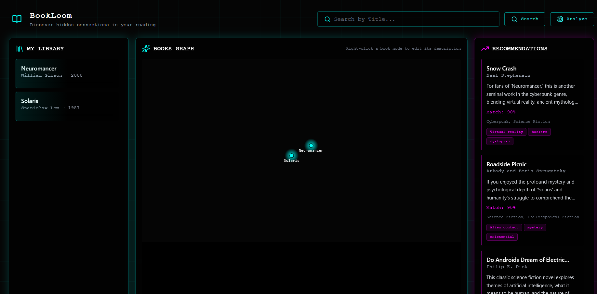

<!-- PROJECT LOGO -->
<br />
<div align="center">
	<!-- Логотип приложения: поместите файл в docs/logo.png или замените ссылку -->
	<!-- Place application logo at docs/logo.png or replace the link -->
	<h1 align="center">Bookloom</h1>
	<p align="center">Full‑stack application for visualizing connections between books and providing intelligent recommendations</p>
</div>

## About the project

This is a monorepo containing the frontend and backend parts of the BookGraph application. This README provides a concise guide to quickly start the entire stack using Docker Compose.

## Quick start (Docker Compose)

Requirements:

- Docker installed (and docker-compose if your environment requires it).

Start all services (frontend + backend):

>[!important] 
>Before starting the services, make sure that you added your environment variables to the `.env` file in backend part.  

```bash
# from the repository root
docker-compose up --build
```

After successful startup, the default service URLs are:

- Frontend: http://localhost:3000
- Backend (API): http://localhost:8000

API documentation (when the backend is running): http://localhost:8000/docs

## Environment variables
Note: environment variables (API keys) can be provided via `.env` files for each service or via a `docker-compose.override.yml` file.


## Screenshots





## Logo

---

© Bookloom Project

