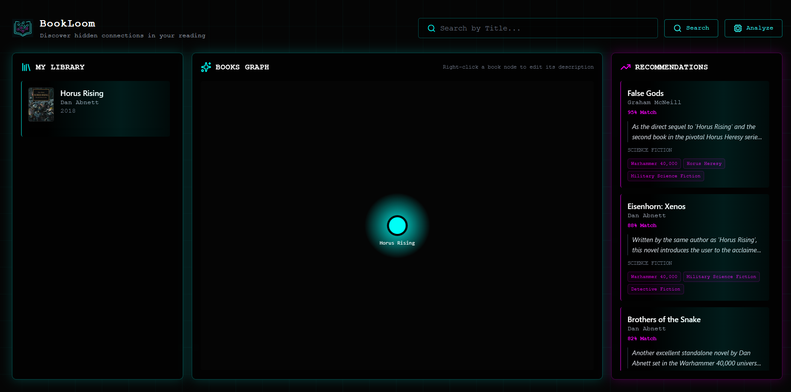

<!-- PROJECT LOGO -->
<br />
<div align="center">
	
	<h1 align="center">Bookloom</h1>
	<p align="center">Full‑stack application for visualizing connections between books and providing intelligent recommendations</p>
</div>

## About the project

This is a monorepo containing the frontend and backend parts of the BookGraph application. This README provides a concise guide to quickly start the entire stack using Docker Compose.

## Prerequisites
 - [Docker](https://www.docker.com/get-started/)
 - Docker-compose will be installed automatically with Docker Desktop
 - Google Books API key
 - Gemini API key
## Quick start (Docker Compose)
1) Clone the repository
```bash
git clone https://github.com/Lalka00pq/Bookloom
```
2) Go to the repository root
```bash
cd Bookloom
```
3) Update the environment variables
```bash
cd app/backend/app
mv .env-example .env
```
Fill in the values in the `.env` file, then return to the root directory

4) Start the services
```bash
# from the repository root
docker-compose up --build
```

After successful startup, the default service URLs are:

- Frontend: http://localhost:3000
- Backend (API): http://localhost:8000

API documentation (when the backend is running): http://localhost:8000/docs

## Screenshots



© Bookloom Project

