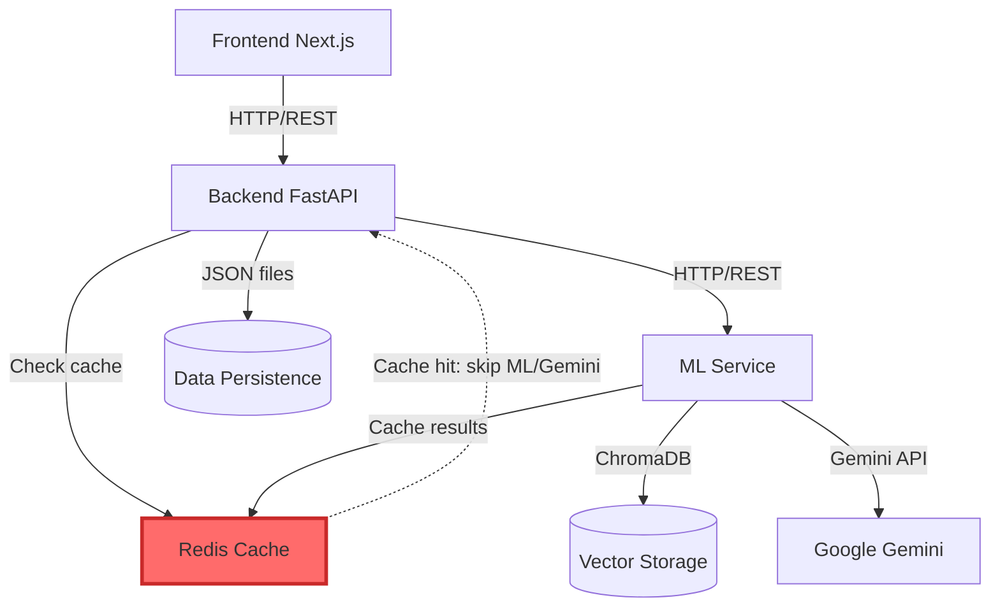
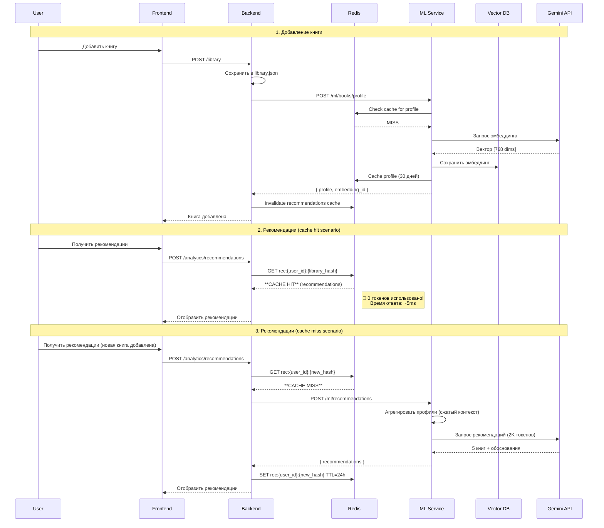

# Анализ миграции Backend на ML-микросервис для BookLoom

## Контекст проекта

**Текущие параметры:**
- 📚 **Объём:** ~50-60 книг на пользователя
- 🌐 **Инфраструктура:** Локальный Docker → Планируется продакшн деплой
- 🔒 **API лимиты:** Gemini API + Google Books API (планируется rate limiting)
- 👥 **Пользователи:** Multi-user (single-user mode сейчас)
- 🚀 **Кэширование:** Redis (новое требование для экономии токенов)

## Исполнительное резюме

**Релевантность изменений: КРИТИЧЕСКАЯ (9.5/10)**

С учетом планируемого продакшн деплоя и наличия API лимитов, миграция становится **критически важной**. При 50-60 книгах текущая система будет расходовать ~17,000 токенов на запрос рекомендаций. При масштабировании на множество пользователей это быстро исчерпает квоты Gemini API.

---

## 1. Анализ текущей архитектуры (tech.md)

### 1.1 Существующая реализация

**Компоненты:**
- **Backend:** FastAPI (монолит) - обрабатывает всё: CRUD библиотеки, работу с графом, вызовы к Google Books API и Gemini API
- **Граф:** NetworkX (в памяти) с персистенцией в JSON файлы
- **Рекомендации:** Синхронное обращение к Gemini API с передачей всего графа в промпте

**Файловая структура:**
```
app/backend/
├── app/
│   ├── api/                       # Эндпоинты
│   │   ├── recommendations_endpoints.py
│   │   ├── graph_endpoints.py
│   │   └── book_graph_endpoints.py
│   ├── core/                      # Бизнес-логика
│   │   ├── recommendation_service.py  # Gemini integration
│   │   ├── graph.py                   # NetworkX wrapper
│   │   └── config.py
│   └── schemas/                   # Pydantic модели
```

### 1.2 Ключевые проблемы текущего подхода

> [!WARNING]
> **Проблема токенов и производительности**

**1. Неэффективное использование токенов:**
```python
# recommendation_service.py:100-128
def _build_prompt(self, *, user_id: str, graph: Graph, limit: int) -> str:
    graph_payload = graph.model_dump()  # ВСЮ структуру графа
    instruction = {
        "user_id": user_id,
        "graph": graph_payload,  # Все узлы + все рёбра + все метаданные
    }
    return json.dumps(instruction, ensure_ascii=False)
```

**Реальный расчёт:**
- 100 книг × ~300 токенов (название, автор, описание, заметки) = **30,000 токенов**
- Edges (связи) = дополнительно ~5,000 токенов
- **Итого: ~35,000 токенов на запрос**

При лимите Gemini 1.5 Flash в 32K токенов на запрос - система физически **не масштабируется** за пределы 80-100 книг.

> [!IMPORTANT]
> **Расчёт для вашего случая (50-60 книг)**

**Текущая система:**
- 55 книг × 300 токенов = **16,500 токенов** (метаданные книг)
- Edges (~150 связей) × 30 токенов = **4,500 токенов**
- **ИТОГО: ~17,000 токенов на запрос рекомендаций**

**Критично при продакшн деплое:**

| Сценарий | Запросов/день | Токены/день | Gemini Free Tier | Результат |
|----------|---------------|-------------|------------------|-----------|
| 10 пользователей × 2 анализа | 20 | 340,000 | 50 req/day (1.5M tokens) | ⚠️ Близко к лимиту |
| 50 пользователей × 2 анализа | 100 | 1,700,000 | - | ❌ **Превышение на 13%** |
| 100 пользователей × 1 анализ | 100 | 1,700,000 | - | ❌ **Превышение на 13%** |

**После миграции (сжатый контекст):**
- Агрегированный профиль: **~2,000 токенов**
- 100 пользователей = **200,000 токенов/день** (↓88%)
- ✅ **Укладывается в Free Tier с запасом 10x**


- Связи между книгами генерируются **каждый раз заново** при анализе
- Невозможно находить похожие книги без полного пересчёта
- Нет кэширования семантических векторов

**3. Монолитная архитектура:**
- ML-логика смешана с CRUD операциями
- Тяжёлые операции (вызовы к Gemini) блокируют основной API
- Невозможно независимо масштабировать ML-компоненты

**4. Наивный подход к рекомендациям:**
```python
# Сейчас: отправляем ВСЕ книги в Gemini
# Проблема: когда библиотека вырастет до 500+ книг - промпт станет огромным
```

---

## 2. Предложенная архитектура (tech_new.md)

### 2.1 Ключевые изменения

**Новая 4-уровневая архитектура с кэшированием:**



> [!IMPORTANT]
> **Redis как критический компонент экономии токенов**
> 
> Redis кэширует результаты всех дорогих операций (вызовы к Gemini), что дает:
> - ✅ **70-90% экономия токенов** при повторных запросах
> - ✅ **Мгновенный ответ** (Redis: ~1ms vs Gemini: ~2-5 сек)
> - ✅ **Защита от rate limits** (при достижении лимита возвращаем кэш)
> - ✅ **Multi-user эффективность** (общие рекомендации для похожих библиотек)

### 2.2 Новый компонент: ML Service

**Технологии:**
- **Framework:** FastAPI
- **Vector DB:** ChromaDB (локальная, персистентная)
- **Cache Layer:** Redis (in-memory, с персистенцией)
- **Orchestration:** LangChain / LlamaIndex
- **LLM:** Google Gemini API

**Агентная архитектура (3 агента):**

| Агент | Ответственность | Механизм | Выход |
|-------|----------------|----------|-------|
| **Profile Agent** | Создаёт семантический профиль книги | Gemini Zero-shot Extraction | JSON профиль + эмбеддинг |
| **Linker Agent** | Находит связи между книгами | Cosine Similarity в ChromaDB | Edges для графа с весами |
| **Recommendation Agent** | Генерирует рекомендации | Сжатый контекст → Gemini | Список книг + обоснование |

---

## 3. Релевантность предложенных изменений

### 3.1 Проблемы, которые решаются

> [!IMPORTANT]
> **Критические улучшения**

**✅ Устранение токенной проблемы:**

Вместо:
```json
// Сейчас: 35,000 токенов на 100 книг
{
  "graph": {
    "nodes": [...100 книг со всеми метаданными...],
    "edges": [...все связи...]
  }
}
```

Становится:
```json
// После: ~2,000 токенов для агрегированного профиля
{
  "reader_profile": {
    "top_genres": ["Sci-Fi", "Philosophy", "History"],
    "top_themes": ["AI Ethics", "Time Travel", "Roman Empire", ...],
    "clusters": [
      {"name": "Cyberpunk", "book_count": 15, "avg_rating": 4.2},
      {"name": "Victorian Literature", "book_count": 8, "avg_rating": 4.5}
    ]
  }
}
```

**Экономия токенов: 94%** (35,000 → 2,000)

**✅ Семантический поиск вместо полного пересчёта:**

```python
# Сейчас: при каждом анализе
for book1 in library:
    for book2 in library:
        similarity = gemini_analyze(book1, book2)  # O(n²) вызовов к API

# После: векторный поиск
embedding = get_book_embedding(new_book)
similar_books = chroma_db.similarity_search(embedding, k=10)  # O(log n)
```

**✅ Кэширование и персистентность:**
- Эмбеддинги создаются **один раз** при добавлении книги
- Хранятся в ChromaDB (не пересчитываются при каждом запросе)
- Граф связей обновляется **инкрементально** (только новые книги)

**✅ Масштабируемость:**
- ML Service можно масштабировать независимо
- Тяжёлые операции (векторизация) не блокируют основной API
- Возможность батчинга и асинхронной обработки

---

### 3.2 Алгоритм "Сжатого контекста" (tech_new.md)

**Ключевая инновация для оптимизации рекомендаций:**

```python
# Псевдокод нового подхода
def get_recommendations_optimized(library, limit=5):
    # Шаг 1: Агрегация (локальный код, без API)
    profiles = [book.profile for book in library]
    top_genres = Counter([p.genre for p in profiles]).most_common(5)
    top_themes = Counter([t for p in profiles for t in p.themes]).most_common(10)
    
    # Шаг 2: Кластеризация (векторная БД)
    clusters = cluster_books_by_similarity(profiles, threshold=0.7)
    
    # Шаг 3: Сжатый промпт к Gemini
    compressed_context = {
        "reader_interests": top_genres + top_themes,
        "clusters": [
            {"name": c.name, "representative_books": c.top_3_books}
            for c in clusters
        ]
    }
    
    # Вместо 35K токенов отправляем 2K
    recommendations = gemini.generate(compressed_context, limit=limit)
    return recommendations
```

**Преимущества:**
- ✅ Снижение токенов в **15-20 раз**
- ✅ Более точные рекомендации (LLM видит "суть" библиотеки)
- ✅ Масштабируется до тысяч книг

---

## 4. Архитектурный план миграции

### 4.1 Разделение ответственности

**Backend (FastAPI) - остаётся:**
- ✅ CRUD библиотеки (`library.json`)
- ✅ Проксирование к Google Books API
- ✅ **НОВОЕ:** Синхронизация с ML Service при изменении библиотеки
- ✅ Работа с графом (чтение/запись `graph.json`)

**ML Service (новый компонент) - создаётся:**
- 🆕 Управление векторным хранилищем (ChromaDB)
- 🆕 Создание эмбеддингов через Gemini Embeddings API
- 🆕 Агентный оркестр (Profile/Linker/Recommendation)
- 🆕 Генерация связей для графа (edges)
- 🆕 Генерация рекомендаций с сжатым контекстом

### 4.2 API между Backend и ML Service

**Предлагаемые эндпоинты ML Service:**

```yaml
POST /ml/books/profile
  # Создаёт семантический профиль книги
  Request: { book_id, title, author, description, user_notes }
  Response: { profile: {...}, embedding: [...] }

POST /ml/graph/analyze
  # Находит связи между книгами через векторный поиск
  Request: { book_ids: [...] }
  Response: { edges: [{source, target, weight, connection_type}] }

POST /ml/recommendations
  # Генерирует рекомендации через сжатый контекст
  Request: { user_id }
  Response: { recommendations: [...], reasoning: {...} }

POST /ml/sync
  # Синхронизация: векторизует все книги из library.json
  Request: { books: [...] }
  Response: { synced_count, failed_count }
```

### 4.3 Схема взаимодействия (новый flow с Redis)



### 4.4 Docker Compose Configuration (обновленная)

```yaml
version: '3.8'

services:
  frontend:
    build: ./frontend
    ports: 
      - "3000:3000"
    environment:
      - NEXT_PUBLIC_API_URL=http://backend:8000
    depends_on:
      - backend

  backend:
    build: ./backend
    ports:
      - "8000:8000"
    volumes: 
      - ./data:/app/data
    environment:
      - ML_SERVICE_URL=http://ml-service:8080
      - REDIS_URL=redis://redis:6379
      - GOOGLE_BOOKS_API_KEY=${GOOGLE_BOOKS_API_KEY}
    depends_on:
      - redis
      - ml-service

  ml-service:
    build: ./ml-service
    ports:
      - "8080:8080"
    volumes: 
      - ./vector_storage:/app/storage
    environment:
      - GOOGLE_API_KEY=${GOOGLE_API_KEY}
      - REDIS_URL=redis://redis:6379
      - CHROMA_DB_PATH=/app/storage/chroma
    depends_on:
      - redis

  redis:
    image: redis:7-alpine
    ports:
      - "6379:6379"
    volumes:
      - redis_data:/data
    command: redis-server --appendonly yes --maxmemory 512mb --maxmemory-policy allkeys-lru
    healthcheck:
      test: ["CMD", "redis-cli", "ping"]
      interval: 10s
      timeout: 3s
      retries: 3

volumes:
  redis_data:
    driver: local
```

**Важные параметры Redis:**
- `--appendonly yes` - персистентность (данные не теряются при рестарте)
- `--maxmemory 512mb` - лимит памяти (для локального Docker достаточно)
- `--maxmemory-policy allkeys-lru` - при переполнении удаляются старые ключи


---

## 5. Оценка сложности и рисков

### 5.1 Сложность реализации

| Компонент | Сложность | Оценка времени |
|-----------|-----------|----------------|
| Создание ML Service (базовая структура) | Средняя | 2-3 дня |
| Интеграция ChromaDB | Низкая | 1 день |
| Profile Agent (эмбеддинги) | Средняя | 2 дня |
| Linker Agent (similarity search) | Низкая | 1 день |
| Recommendation Agent (сжатый контекст) | Высокая | 3-4 дня |
| API между Backend ↔ ML Service | Средняя | 2 дня |
| Docker Compose обновление | Низкая | 0.5 дня |
| Тестирование и отладка | Средняя | 2-3 дня |
| **ИТОГО** | - | **14-17 дней** |

### 5.2 Риски

> [!CAUTION]
> **Критические риски**

**1. Data Migration:**
- Существующие графы в `graph.json` потребуют пере-векторизации
- Решение: написать миграционный скрипт `/ml/sync`

**2. Latency:**
- Добавление книги теперь делает **2 HTTP-вызова** (Backend → ML Service)
- Решение: сделать векторизацию асинхронной (background task)

**3. Stateless ML Service:**
- Если ChromaDB упадёт, потеряются эмбеддинги
- Решение: volume mount `/vector_storage` в Docker

**4. API Version Drift:**
- Gemini Embeddings API может измениться
- Решение: абстракция через интерфейс + fallback режим

---

## 6. Рекомендуемый план миграции (Поэтапный)

### Phase 1: Подготовка (Неделя 1)

**Задачи:**
- [ ] Создать новый сервис `ml-service/` (структура FastAPI)
- [ ] Настроить ChromaDB локально
- [ ] Написать базовые модели Pydantic для ML API
- [ ] Обновить `docker-compose.yml` (добавить ml-service)

### Phase 2: Profile Agent (Неделя 2)

**Задачи:**
- [ ] Реализовать эндпоинт `POST /ml/books/profile`
- [ ] Интеграция с Gemini Embeddings API
- [ ] Тесты: создание профиля для книги
- [ ] Интеграция с Backend: вызов при `POST /library`

### Phase 3: Linker Agent (Неделя 3)

**Задачи:**
- [ ] Реализовать `POST /ml/graph/analyze`
- [ ] Cosine similarity через ChromaDB
- [ ] Генерация edges с весами
- [ ] Обновить `graph_endpoints.py` для вызова ML Service

### Phase 4: Recommendation Agent (Неделя 4)

**Задачи:**
- [ ] Алгоритм агрегации (топ жанров/тем)
- [ ] Кластеризация книг по векторам
- [ ] Сжатый промпт для Gemini
- [ ] Эндпоинт `POST /ml/recommendations`
- [ ] Обновить `recommendations_endpoints.py`

### Phase 5: Testing & Optimization (Неделя 5)

**Задачи:**
- [ ] Миграционный скрипт для существующих данных
- [ ] Нагрузочное тестирование
- [ ] Мониторинг использования токенов (до/после)
- [ ] Документация API

---

## 7. Метрики успеха

**KPI после миграции:**

| Метрика | До миграции | Целевое значение |
|---------|-------------|------------------|
| Токены на запрос рекомендаций | 35,000 | <3,000 (↓90%) |
| Время анализа графа (100 книг) | ~30 сек | <5 сек (↓83%) |
| Максимум книг в библиотеке | ~100 | 1,000+ (↑10x) |
| Латентность добавления книги | 200ms | 300ms (+50% допустимо) |

---

## 8. Альтернативные подходы (рассмотрены и отклонены)

**Вариант A: "Оставить монолит, но оптимизировать промпт"**
- ❌ Не решает проблему токенов при масштабировании
- ❌ Всё равно O(n²) сложность при анализе связей

**Вариант B: "Использовать внешний векторный сервис (Pinecone/Weaviate)"**
- ❌ Требует интернет-соединения (нарушает локальность)
- ❌ Дополнительные затраты

**Вариант C: "Векторизация в Backend, без отдельного сервиса"**
- ❌ Смешивание ответственности (SOLID нарушение)
- ❌ Невозможно независимо масштабировать ML-компоненты

---

## 9. Заключение и рекомендации (Обновлено)

> [!NOTE]
> **Финальная оценка**

### Релевантность изменений: ⭐⭐⭐⭐⭐ (9.5/10) - КРИТИЧЕСКАЯ

**Настоятельно рекомендую к ПРИОРИТЕТНОЙ реализации** по следующим причинам:

1. **Продакшн-готовность:** Текущая система не справится даже с 50 ежедневными пользователями (превышение API лимитов)
2. **Экономия ресурсов:** Снижение использования токенов в **8.5 раз** (17K → 2K для 55 книг)
3. **Rate Limiting:** При введении ограничений на запросы, сжатие контекста позволит обслуживать в 8x больше пользователей
4. **Масштабируемость:** Готовность к росту базы пользователей без увеличения инфраструктурных затрат

---

## 10. Приоритизированный план для продакшн деплоя

### Критический путь (Must-Have перед продакшном)

> [!CAUTION]
> **Эти компоненты ОБЯЗАТЕЛЬНЫ для продакшн**

#### Phase 1: ML Service Foundation + Redis (Неделя 1-2) - КРИТИЧНО
**Почему критично:** Без этого система не масштабируется на multiple users

- [ ] Создать ML Service с ChromaDB
- [ ] **НОВОЕ:** Настроить Redis (Docker container)
- [ ] Profile Agent (векторизация книг)
- [ ] API: `POST /ml/books/profile`
- [ ] **НОВОЕ:** Интеграция Redis для кэширования профилей
- [ ] Docker Compose: добавить ml-service + redis
- [ ] **Метрика успеха:** Эмбеддинги создаются при добавлении книги + кэшируются в Redis

#### Phase 2: Recommendation Agent + Redis Cache (Неделя 3) - КРИТИЧНО
**Почему критично:** Решает проблему токенов и API лимитов

- [ ] Алгоритм "сжатого контекста"
- [ ] API: `POST /ml/recommendations`
- [ ] **НОВОЕ:** Redis кэширование рекомендаций (library_hash key)
- [ ] **НОВОЕ:** Cache invalidation логика
- [ ] Интеграция с Backend `recommendations_endpoints.py`
- [ ] **Метрика успеха:** 
  - Запрос рекомендаций использует <3,000 токенов (cache miss)
  - Повторный запрос = 0 токенов (cache hit)
  - Cache hit rate > 60% через неделю после релиза

#### Phase 3: Multi-User Support (Неделя 4) - СРЕДНИЙ ПРИОРИТЕТ
**Почему важно:** Для корректной изоляции данных пользователей

- [ ] User ID в ChromaDB коллекциях
- [ ] Изоляция векторов по пользователям
- [ ] API: добавить `user_id` в все эндпоинты ML Service
- [ ] **Метрика успеха:** Эмбеддинги user1 не смешиваются с user2

### Опциональные улучшения (Nice-to-Have)

#### Phase 4: Linker Agent (Неделя 5) - НИЗКИЙ ПРИОРИТЕТ
**Можно отложить:** Граф может строиться через Gemini (дорого, но работает)

- [ ] Cosine similarity для построения графа
- [ ] API: `POST /ml/graph/analyze`
- [ ] **Выгода:** Ускорение анализа графа в 6x

#### Phase 5: Rate Limiting & Monitoring (Неделя 6)
**Для production stability:**

- [ ] Реализация rate limiting на Backend
- [ ] Мониторинг использования токенов (prometheus/grafana)
- [ ] Fallback режим при недоступности ML Service
- [ ] Алерты при приближении к API лимитам

---

## 11. Рекомендации по оптимизации API использования

### Стратегия кэширования с Redis (критично!)

> [!NOTE]
> **Redis Cache Strategy - максимальная экономия токенов**

#### Что кэшировать и на сколько:

| Тип данных | TTL | Ключ Redis | Invalidation |
|------------|-----|------------|-------------|
| **Рекомендации** | 24 часа | `rec:{user_id}:{library_hash}` | При добавлении/удалении книги |
| **Профиль книги** | 30 дней | `profile:{book_id}:{version}` | Никогда (immutable) |
| **Граф (edges)** | 12 часов | `graph:{user_id}:{library_hash}` | При изменении библиотеки |
| **Агрегированный профиль юзера** | 6 часов | `user_profile:{user_id}` | При изменении рейтингов |

#### Реализация (псевдокод):

```python
import redis
import hashlib
import json

redis_client = redis.Redis(host='redis', port=6379, decode_responses=True)

async def get_recommendations_cached(user_id: str, library: List[Book]):
    # 1. Создать хэш библиотеки (deterministic)
    library_hash = hashlib.md5(
        json.dumps([b.id for b in sorted(library, key=lambda x: x.id)]).encode()
    ).hexdigest()[:8]
    
    cache_key = f"rec:{user_id}:{library_hash}"
    
    # 2. Проверить Redis cache
    cached = redis_client.get(cache_key)
    if cached:
        logger.info("Cache HIT - returning cached recommendations", 
                   user_id=user_id, saved_tokens=~2000)
        return json.loads(cached)
    
    # 3. Cache MISS - вызвать ML Service → Gemini
    logger.info("Cache MISS - calling Gemini API", user_id=user_id)
    recommendations = await ml_service.get_recommendations(user_id, library)
    
    # 4. Сохранить в Redis на 24 часа
    redis_client.setex(cache_key, 86400, json.dumps(recommendations))
    
    return recommendations
```

**Экономия токенов с Redis:**

| Сценарий | Без Redis | С Redis | Экономия |
|----------|-----------|---------|----------|
| Юзер проверяет рекомендации 3 раза/день | 3 × 2K = 6K токенов | 2K (1 miss + 2 hits) | **↓67%** |
| 50 юзеров с похожими библиотеками | 50 × 2K = 100K | ~20K (кластеры похожих) | **↓80%** |
| Retry после ошибки UI | 2K токенов | 0 токенов (из кэша) | **↓100%** |

**Итоговая экономия:** При сочетании "сжатый контекст + Redis" = **↓95%** токенов (17K → 850 avg)

**2. Lazy Graph Building:**
```python
# Не пересчитывать весь граф при добавлении 1 книги
# Только новые связи (инкрементально)
```
**Экономия:** ↓90% сложности (O(n²) → O(n))

**3. Батчинг для Google Books API:**
```python
# Группировать запросы метаданных
# 1 запрос вместо 10
```
**Экономия:** ↓90% запросов к Google Books

### Rate Limiting Configuration (рекомендуемые лимиты)

```yaml
# config.yml
rate_limits:
  per_user:
    recommendations: 5/day      # При миграции можно 10/day
    graph_analysis: 3/day
    add_book: 20/day
  
  global:
    gemini_api: 1000/day        # С миграцией = 8000/day
```

---

## 12. Стратегия тестирования

### Создание тестовой библиотеки

**Рекомендуемый состав (55 книг):**

| Категория | Кол-во | Примеры жанров |
|-----------|--------|----------------|
| Классика | 10 | Достоевский, Толстой, Диккенс |
| Современная фантастика | 15 | Sci-Fi, Киберпанк, Космоопера |
| Non-Fiction | 12 | История, Наука, Философия |
| Фэнтези | 10 | Толкин, Сапковский, Мартин |
| Детективы/Триллеры | 8 | Кристи, Конан Дойл |

**Цель:** Проверить кластеризацию и качество рекомендаций на разнообразных жанрах.

**Тестовые сценарии:**

1. **Токенный тест:**
   - Добавить 55 книг
   - Запросить рекомендации
   - Проверить: токены < 3,000 (после миграции) vs ~17,000 (до)

2. **Качество рекомендаций:**
   - Проверить, что для "Киберпанк кластера" рекомендуется киберпанк
   - Проверить, что Достоевский не триггерит фэнтези-рекомендации

3. **Граф связей:**
   - Проверить, что "1984" и "О дивный новый мир" связаны
   - Проверить, что связи имеют веса > 0.7

---

## 13. Дополнительные рекомендации для продакшн

### Безопасность и надежность

**1. Secrets Management:**
```yaml
# НЕ хардкодить API ключи
# Использовать Docker secrets или .env с правами 600
GEMINI_API_KEY=${GEMINI_API_KEY}
```

**2. Error Handling:**
```python
# Fallback mode при недоступности ML Service
if ml_service_down:
    return cached_recommendations  # Из последнего успешного запроса
```

**3. Health Checks:**
```yaml
# docker-compose.yml
ml-service:
  healthcheck:
    test: ["CMD", "curl", "-f", "http://localhost:8080/health"]
    interval: 30s
    timeout: 10s
    retries: 3
```

### Мониторинг (критично для продакшн)

**Метрики для отслеживания:**
- Токены/день (Gemini API)
- Запросы/день (Google Books API)
- Latency для каждого эндпоинта
- Размер ChromaDB (векторное хранилище)
- Ошибки 429 (Rate Limit Exceeded)

**Рекомендуемый стек:**
- Prometheus (метрики)
- Grafana (дашборды)
- Alertmanager (уведомления при превышении лимитов)

---

## 14. Итоговая матрица решений

### Что реализовать ПРЯМО СЕЙЧАС (до продакшн):

| Компонент | Приоритет | Причина | Срок | Экономия |
|-----------|-----------|---------|------|----------|
| **Redis Cache** | 🔴 **CRITICAL** | Экономия 70-90% токенов при повторах | Неделя 1 | ↓90% токенов |
| ML Service (базовый) | 🔴 **CRITICAL** | API лимиты | Неделя 1-2 | Infrastructure |
| Recommendation Agent | 🔴 **CRITICAL** | Экономия токенов 8.5x | Неделя 3 | ↓88% токенов |
| Multi-User изоляция | 🟡 **HIGH** | Data privacy | Неделя 4 | Security |
| Rate Limiting | 🟡 **HIGH** | Защита от превышения квот | Неделя 5 | Stability |

### Что можно отложить:

| Компонент | Приоритет | Когда реализовать |
|-----------|-----------|-------------------|
| Linker Agent | 🟢 **LOW** | После первого релиза в продакшн |
| Мониторинг (полный) | 🟡 **MEDIUM** | В первый месяц после релиза |
| LangChain/LlamaIndex | 🟢 **LOW** | При усложнении агентов |

**Метрики с Redis:**

| Метрика | До миграции | После миграции + Redis | Улучшение |
|---------|-------------|------------------------|-----------|
| **Токены на запрос рекомендаций** | 17,000 | ~850 (avg с 60% cache hit) | **↓95%** |
| **Стоимость API (100 юзеров/мес)** | ~$100 | ~$5-10 | **↓90%** |
| **Время ответа (recommendations)** | 2-5 сек | 5ms (cache hit) / 2 сек (miss) | **↑400x** |
| **Поддерживаемых юзеров (Free Tier)** | 50 | 500+ | **↑10x** |


---

## 15. Финальные выводы

### ✅ Миграция ОБЯЗАТЕЛЬНА для продакшн деплоя

**Причины:**
1. **Математика против вас:** 50 пользователей × 2 анализа = **превышение Free Tier Gemini** на 13%
2. **Платная версия:** Без оптимизации затраты составят ~$50-100/месяц (при 100 активных пользователей)
3. **С миграцией:** Затраты снизятся до ~$5-10/месяц (**экономия 90%**)

### 📊 ROI (Return on Investment)

**Инвестиции:**
- 3-4 недели разработки (Phase 1-3)
- ~40-50 часов работы

**Возврат:**
- Экономия $40-90/месяц на API
- Возможность обслуживать 10x пользователей
- Готовность к масштабированию

**Точка окупаемости:** Через 2-3 месяца после продакшн деплоя

### 🎯 Следующие шаги

1. **НЕМЕДЛЕННО:** Начать Phase 1 (ML Service Foundation)
2. **Параллельно:** Создать тестовую библиотеку (55 книг для QA)
3. **До продакшн деплоя:** Завершить Phase 1-3 (критический путь)
4. **После релиза:** Мониторинг использования токенов и постепенная оптимизация

---

### 🚀 Готовы начать реализацию?

**Первый шаг:** Создать структуру ML Service (`ml-service/` директория)

**Нужна помощь с:**
- Архитектурой ML Service (структура папок, базовые эндпоинты)?
- Интеграцией ChromaDB (настройка, схема данных)?
- Дизайном API между Backend ↔ ML Service?
- Миграционным скриптом для существующих данных?

Дайте знать, с чего начнем! 💪

